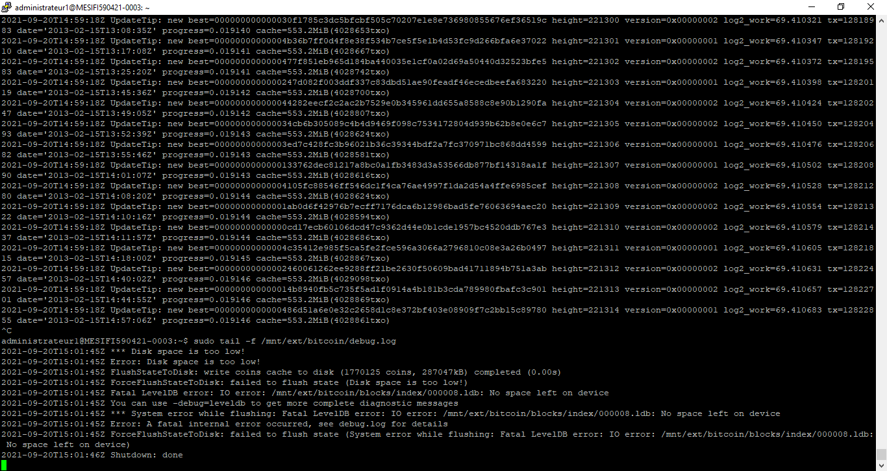

# TD 1 Monnaie Numérique

## Setting up SSH properly

Dans un premier temps on crée une clé publique et un clé privée RSA sur notre machine avec les outils Putty (dans le cas d'une machine sous windows).


On stocke ensuite les clés privée et publique dans deux fichiers différents sur l'emplacement de notre choix. On pensera à bien sécuriser le fichier contenant la clé privée, qui est l'information sensible.


On créer ensuite un dossier caché `.ssh` à la racine de la machine virtuelle. Dans ce dossier on crée un fichier `authorized_keys` dans lequel on colle la clé ssh. Une fois ce dossier sécurisé avec la commande `chmod -R 700 .ssh/` on peut se connecter via ssh depuis Putty en indiquant l'emplacement de la clé ssh sur notre machine physique.

Il est également possible de désactivé la connexion via mot de passe sur la machine virtuelle pour n'utiliser que la connexion via ssh sur la machine virtuelle. Il faut être prudent en réalisant cette opération et s'assurer que la connexion par ssh fonctionne bien avant de désactiver la connexion par mot de passe.

## Setting up UFW and Fail2Ban 

### UFW 

Pour installer UFW (uncomplicated firewall) nous avons suivi les comandes suivantes: 


### Fail2Ban

Fail2ban permet de contrer les attaques par forces brute en bloquant les tentatives de connexion après un certain nombre tentatives de connexions avec un mot de passe éronné.
L'installation de fail2Ban se fait facilement avec la commande `sudo apt install fail2ban`, puis en utilisant la configuration par défault de fail2ban.

## Installing Bitcoind 

Lors de l'installation de BitcoinD il est préférable de vérifier la checksum des fichiers téléchargé pour vérifier l'intégrité de ce que l'on vient de télécharger, mais étant donné que nous utilisons une vm pour quelques jours seulement et sans y mettre d'argent réel, nous avons passé cette étape de sécurité.

Là encore pour encore pour l'installation nous avons tout simplement suivis les commandes du tutoriel donné, cependant au lieu de sélectionner la version ARM 21.1 de Bitcoin Core nous avons pris la version 22.0 Linux (https://bitcoincore.org/bin/bitcoin-core-22.0/bitcoin-22.0-x86_64-linux-gnu.tar.gz) étant donné que l'ARM est supporté par la Raspberry.

## Turning BitcoinD into a service

Une fois BitcoinD installé changer d'utilisateur ```sudo - su bitcoin``` (crée préalablement) et crée le fichier de configuration. Pour lancer BitcoinD en testnet écrire dans la console ```bitcoind -testnet```, une connexion s'effectue puis les blocs sont synchronisés. Toutefois on souhaiterais que bitcoind se lance automatiquement au démarrage, on crée alors le fichier *bitcoind.service* et on effectue un léger changement pour lancer en testnet.

```
...
ExecStart=/usr/local/bin/bitcoind -testnet \ 
                                  -daemon \
                                  -pid=/run/bitcoind/bitcoind.pid \
                                  -conf=/mnt/ext/bitcoin/bitcoin.conf \
                                  -datadir=/mnt/ext/bitcoin
...
```

La version testnet ne se lançant pas correctement, on retire alors ce paramètre et on active le service. La prochaine fois au redémarrage on peut vérifier que le service s'est bien éxécuter en daemon avec ```systemctl status bitcoind.service``` et surveiller l'avancement avec ```sudo tail -f /mnt/ext/bitcoin/debug.log```



Malheureusement à nouveau après quelques minutes une erreur *'Disk space is too low'* intervient et il est impossible de continuer.

Nous tenterons tout de même d'avancer le plus possible mais sans les noeuds installés nous seront limités en tâches.

## Creating a wallet and depositing tBTC in it 

## Installing LND

## Turning LND into a service

## Opening a lightning channel

## Setting up Tor

## Running your own BTC explorer
